# BloodHound

<?xml version="1.0" encoding="UTF-8"?>
<node/>

## victime_machine

download  sharpHound.ps1

Invoke-BloodHound -CollectionMethod All -Domain Boss.local -ZipFileName file.zip

after finshing, zip file will be saved in users/pparker

take it and upload it on bloodhound on kali

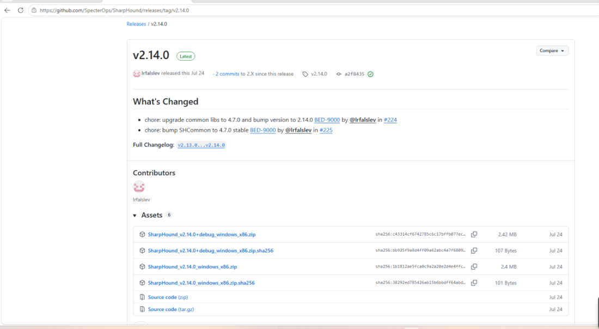

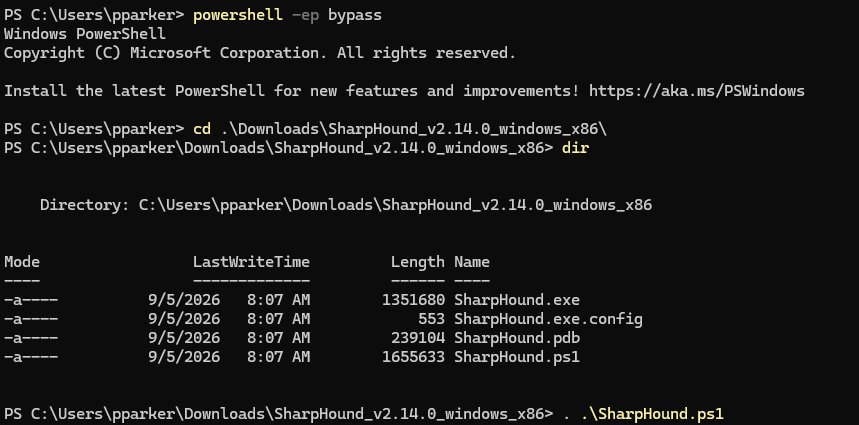

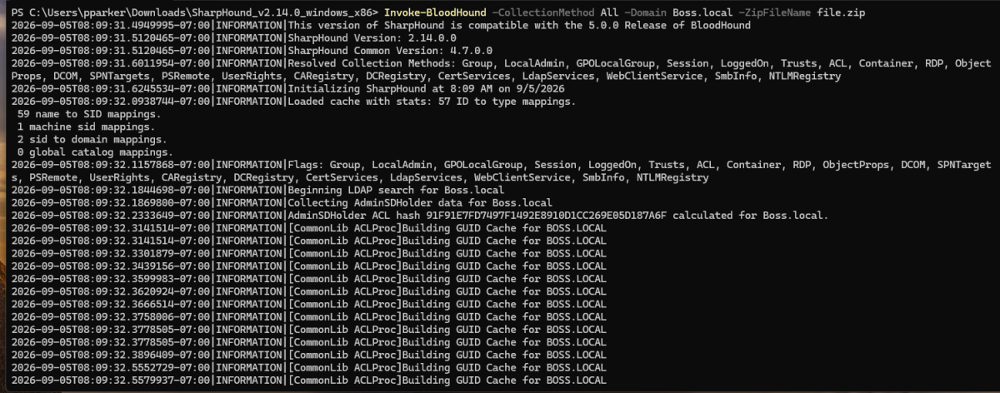

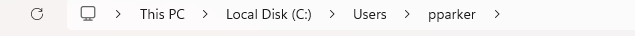

## Kali-setup

sudo apt install bloodhound

create a new password.

now we can start enumerating:

All Domain Admins: 

shortest paths to DomainAdmins:

notice that ADMINISTRATOR user has a session on Domain-Controller computer so we can do attacks such as session impersonation.

and we can do alot and alot with this powerfull tool

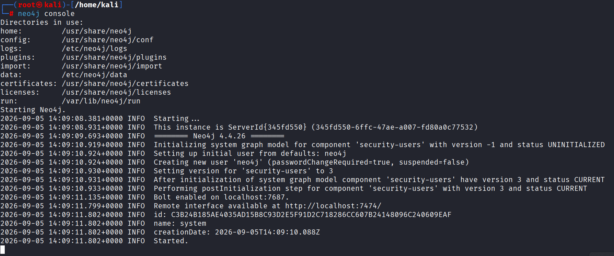

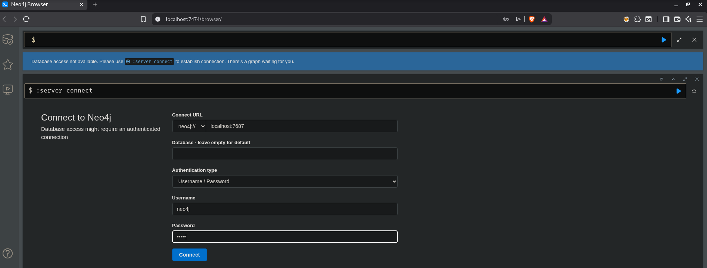

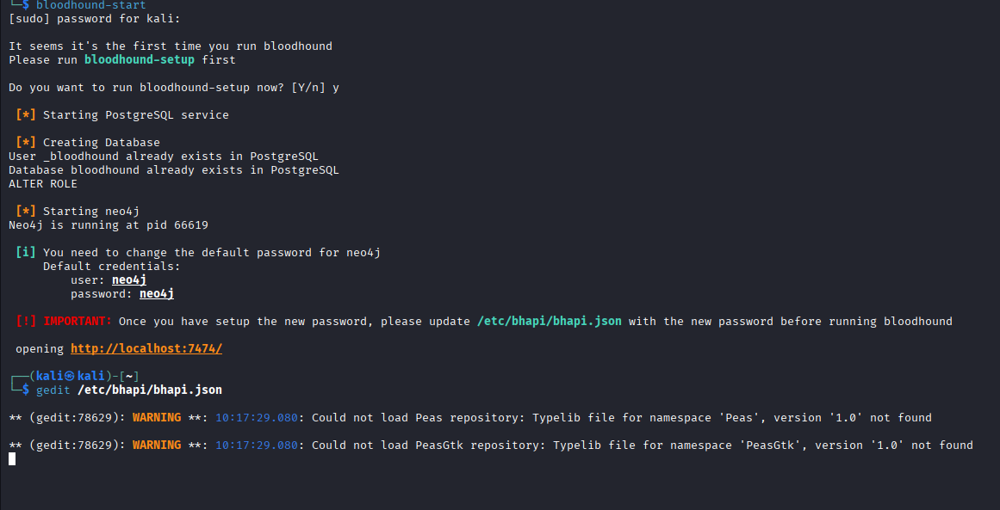

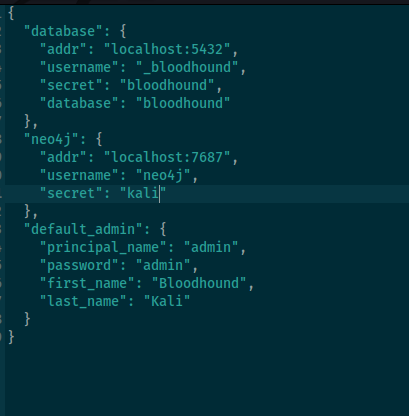

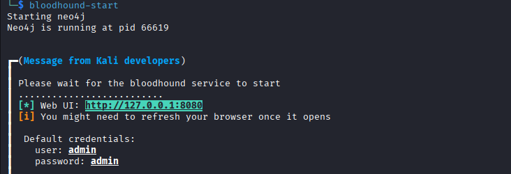

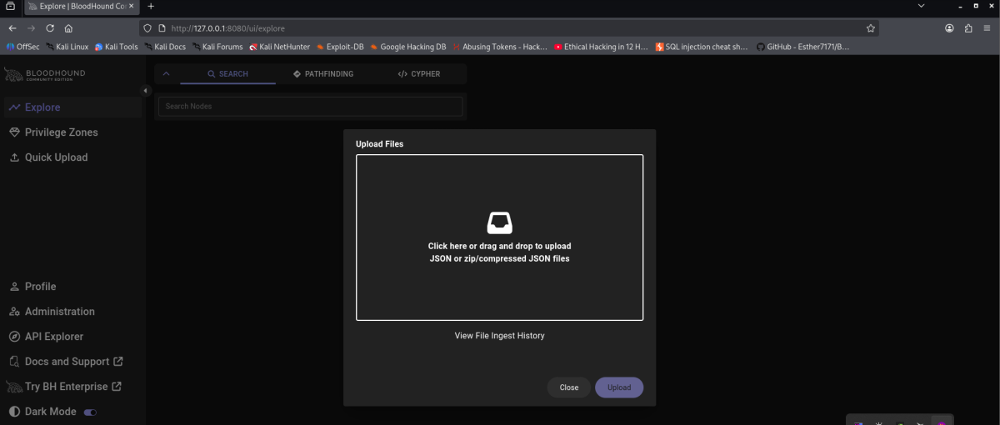

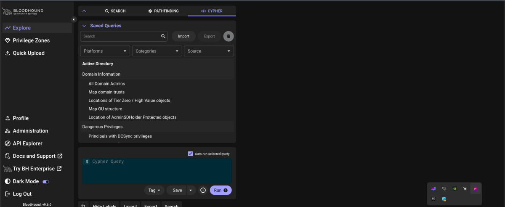

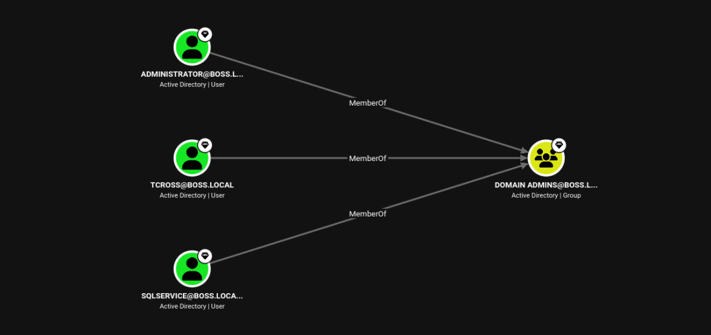

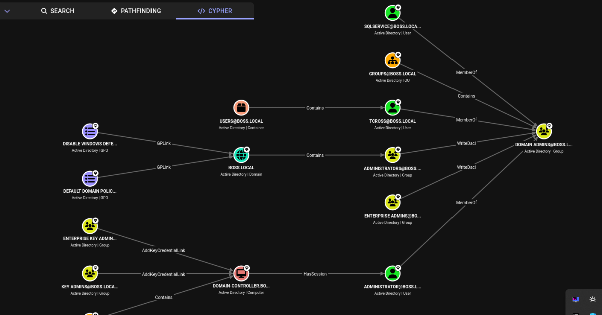

