# PowerView

<?xml version="1.0" encoding="UTF-8"?>
<node><rich_text justification="left"></rich_text><rich_text>

</rich_text><rich_text justification="left"></rich_text><rich_text>

</rich_text><rich_text justification="left"></rich_text><rich_text>

</rich_text><rich_text justification="left"></rich_text><rich_text>

</rich_text><rich_text justification="left"></rich_text><rich_text>

</rich_text><rich_text justification="left"></rich_text><rich_text>

</rich_text><rich_text justification="left"></rich_text><rich_text>

</rich_text><rich_text justification="left"></rich_text><rich_text>

</rich_text><rich_text justification="left"></rich_text><rich_text>

</rich_text><rich_text justification="left"></rich_text><rich_text>

</rich_text><rich_text justification="left"></rich_text><rich_text>

</rich_text><rich_text justification="left"></rich_text><rich_text>

</rich_text><rich_text justification="left"></rich_text><rich_text>

</rich_text></node>

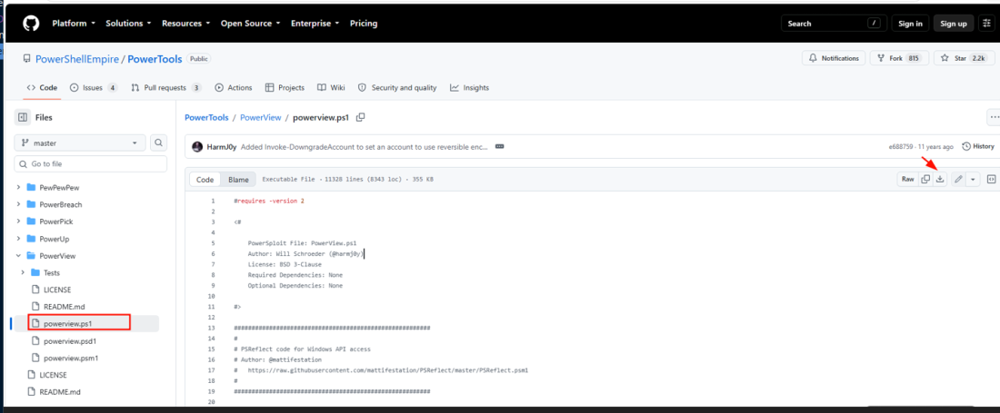

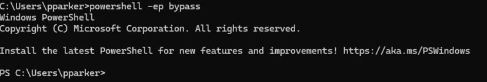

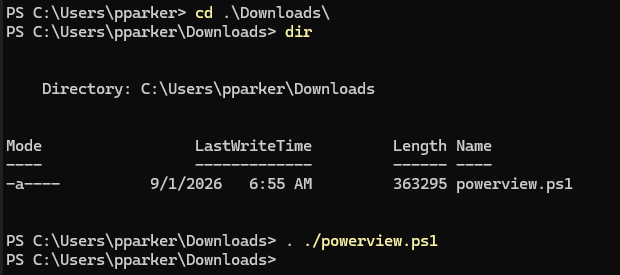

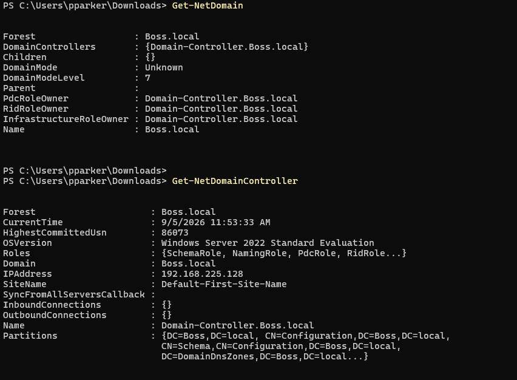

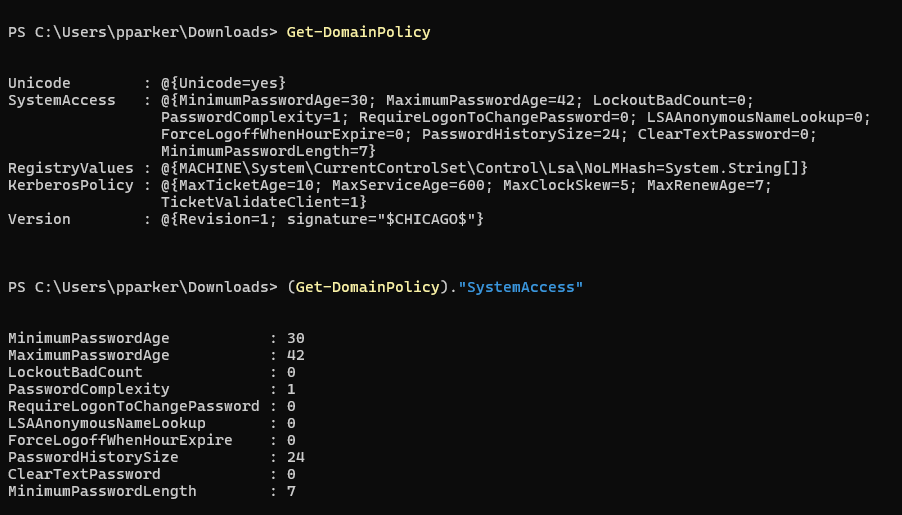

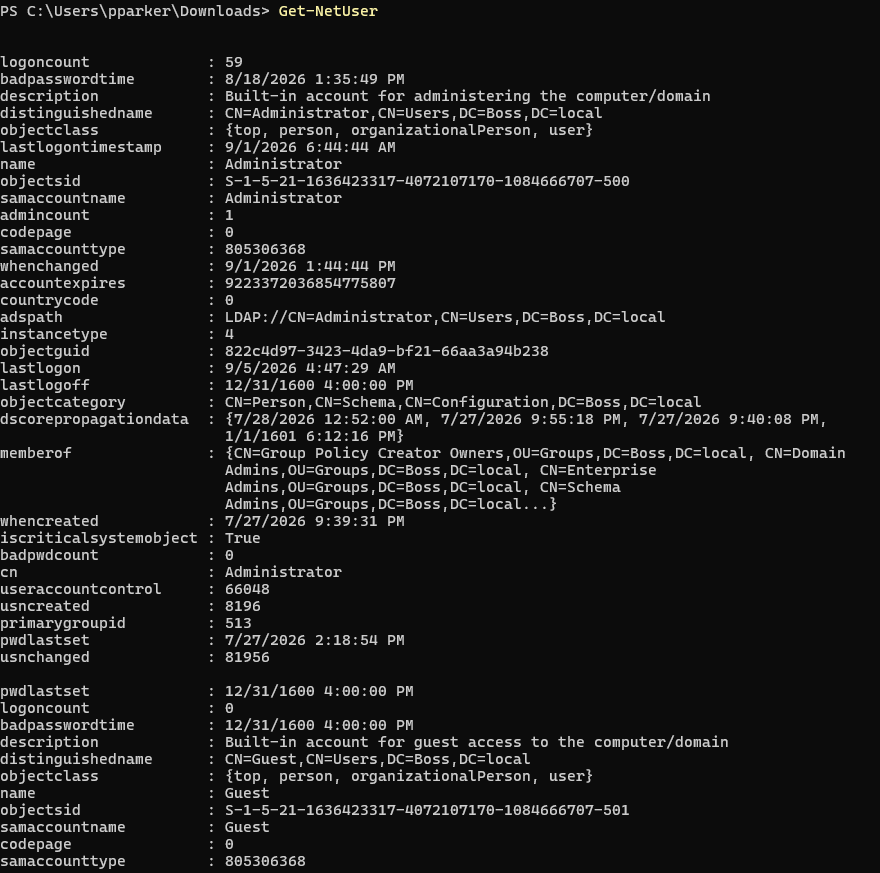

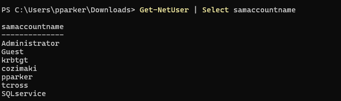

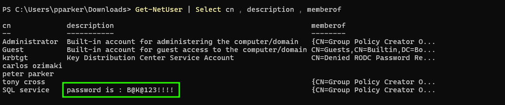

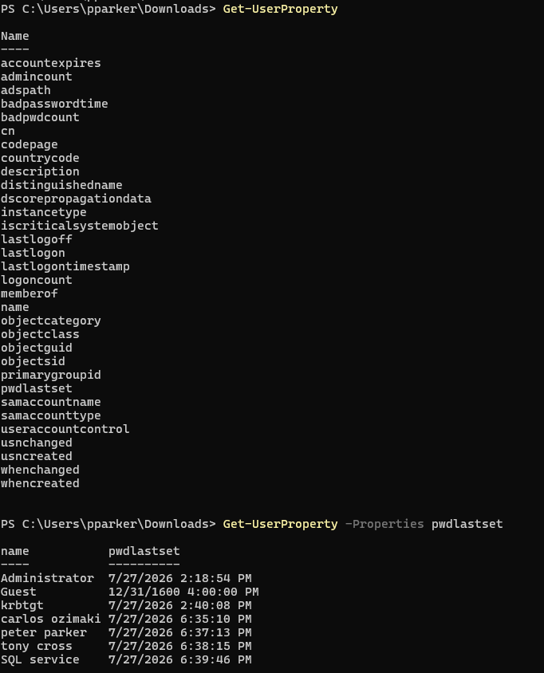

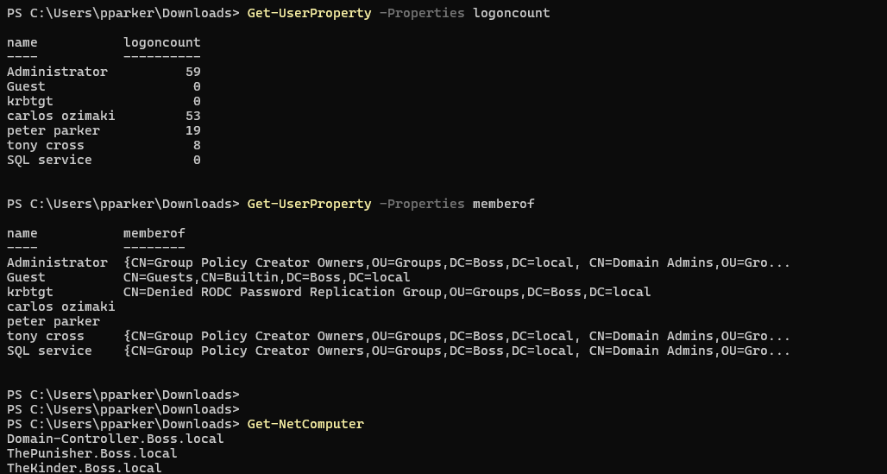

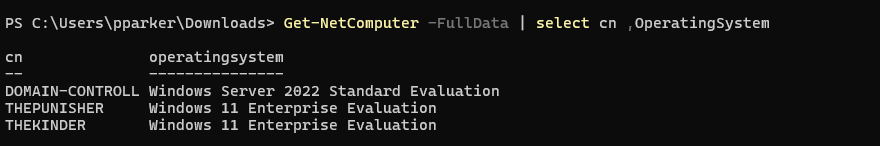

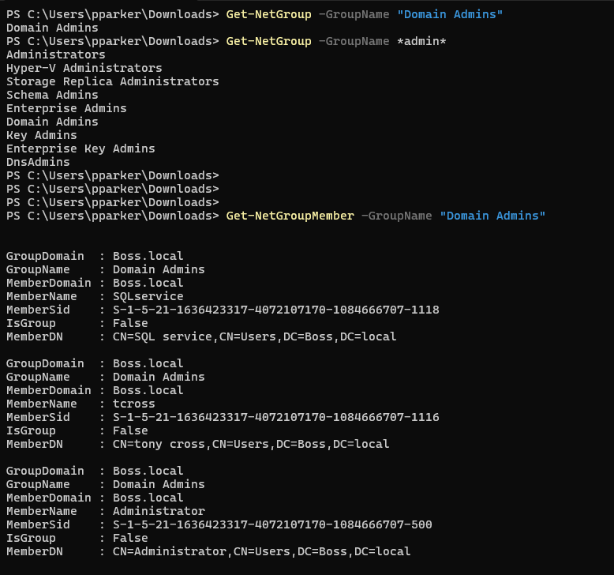

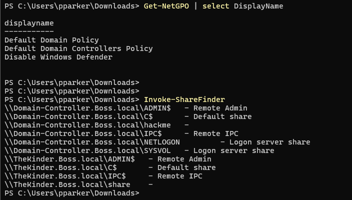

## commands

<?xml version="1.0" encoding="UTF-8"?>
<node><rich_text>commands:

Get-NetDomain
Get-NetDomainController
Get-DomainPolicy
(Get-DomainPolicy)."system access"
Get-NetUser

Get-NetUser | select cn
Get-NetUser | select samaccountname
Get-NetUser | select description

Get-UserProperty 
Get-UserProperty -Properties pwdlastset
Get-UserProperty -Properties logoncount
Get-UserProperty -Properties badpwdcount

Get-NetComputer
Get-NetComputer -FullData
Get-NetComputer -FullData | select OperatingSystem

Get-NetGroup -GroupName "Domain Admins"
Get-NetGroup -GroupName *admin*

Get-NetGroupMember -GroupName "Domain Admins"

Invoke-ShareFinder

Get-NetGPO
</rich_text></node>

