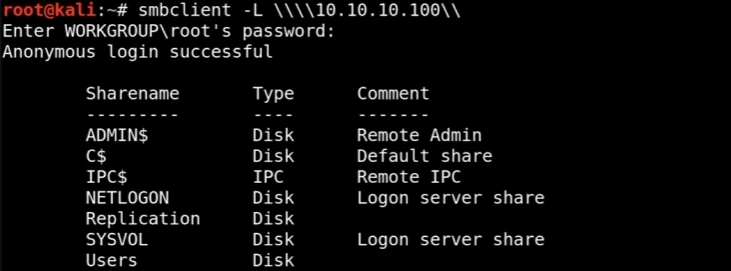
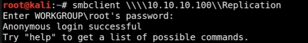
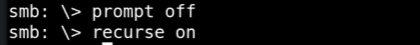
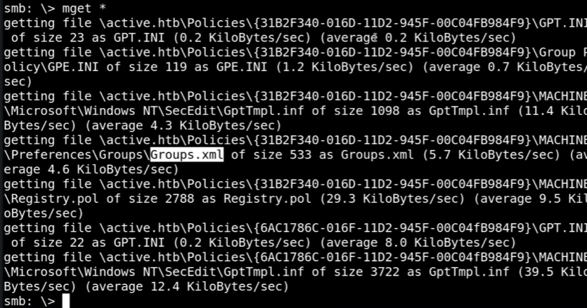
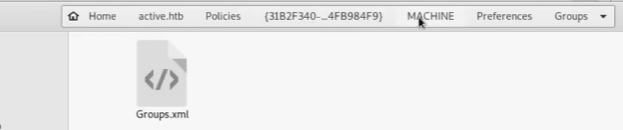
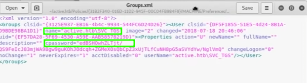
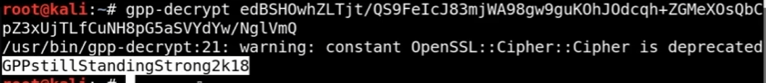

# GPP Attack

<?xml version="1.0" encoding="UTF-8"?>
<node><rich_text>GROUP POLICY PREFERENCES (GPP):

What is GPP?
-------------
Group Policy Preferences (GPP) is a Microsoft feature that allows administrators
to configure settings on many domain-joined computers automatically.

Examples:
- Create local users
- Configure services
- Create scheduled tasks
- Map network drives
- Set registry values
- Copy files

Why were passwords stored?
--------------------------
Administrators often needed to deploy accounts or services across hundreds of
computers without manually configuring each one.

Examples:
- Local Administrator accounts
- Help Desk accounts
- Service accounts
- Scheduled Task accounts

Example:
Create a local account on all computers:

Username: HelpDeskAdmin
Password: P@ssw0rd123

The password would be stored in a GPP XML file inside SYSVOL.

Where were passwords stored?
----------------------------
Passwords were stored in XML files such as:

- Groups.xml
- Services.xml
- ScheduledTasks.xml
- Drives.xml

Located in:

\\DOMAIN\SYSVOL\DOMAIN\Policies\

The password appeared as an encrypted value called:

cpassword="..."

Why was this vulnerable?
------------------------
All authenticated domain users can read SYSVOL.

Microsoft encrypted the passwords using AES, but used ONE FIXED AES KEY for
every domain in the world.

Domain A ---&gt; Same AES Key
Domain B ---&gt; Same AES Key
Domain C ---&gt; Same AES Key

How did clients decrypt the password?
-------------------------------------
When a computer applied a GPP policy:

1. Download XML from SYSVOL
2. Read cpassword
3. Decrypt it
4. Create the account/service/task

Because every client needed to decrypt the password, the decryption key was
embedded in Microsoft's Group Policy client code.

Security researchers reverse-engineered the code and recovered the key.

Once the key became public, anyone could decrypt any GPP password.

Attack Flow
-----------
1. Compromise any domain user account
2. Read SYSVOL
3. Find XML files containing cpassword
4. Extract cpassword
5. Decrypt using the public Microsoft key
6. Recover plaintext credentials
7. Move laterally or escalate privileges

tools used : 

1) Get-GPPPassword (finds cpassword and decrypt it)  </rich_text><rich_text foreground="#33d17a">(on windows)</rich_text><rich_text>
2) Metasploit post/windows/gather/credentials/gpp   (finds cpassword and decrypt it)
3) Net-Exec --gpp-password (finds cpassword and decrypt it)
4) using smbclient + gpp-decrypt 
</rich_text><rich_text justification="left"></rich_text><rich_text>
</rich_text><rich_text justification="left"></rich_text><rich_text>
</rich_text><rich_text justification="left"></rich_text><rich_text>
</rich_text><rich_text justification="left"></rich_text><rich_text>

</rich_text><rich_text justification="left"></rich_text><rich_text>

</rich_text><rich_text justification="left"></rich_text><rich_text>

</rich_text><rich_text justification="left"></rich_text><rich_text>

so we got account : 
user : active.htb\svc_tgs 
pass: GPPstillStandingStrong2k18

</rich_text><rich_text foreground="#33d17a">after this use credentials for laterally or escalate privileges </rich_text><rich_text>like doing kerberoasting attack,gaining shell access (psexec,psexec.py,smbexec,wmiexec), ..etc 
</rich_text></node>

