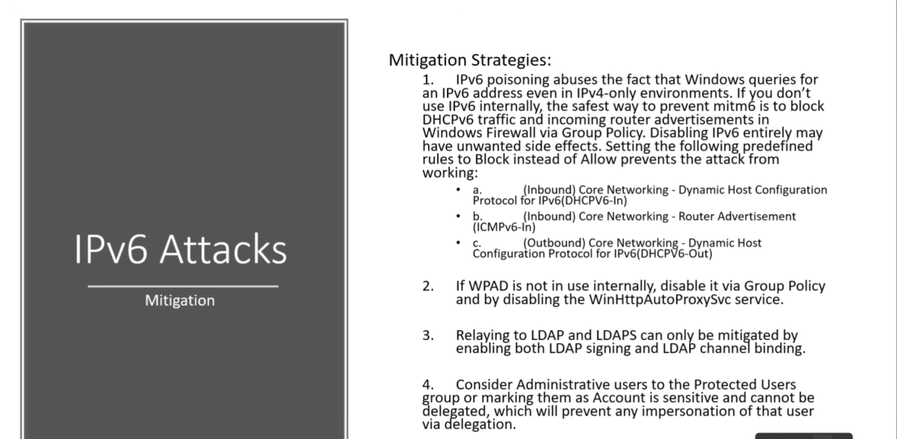
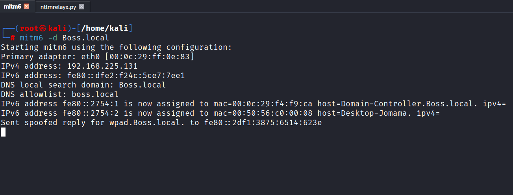
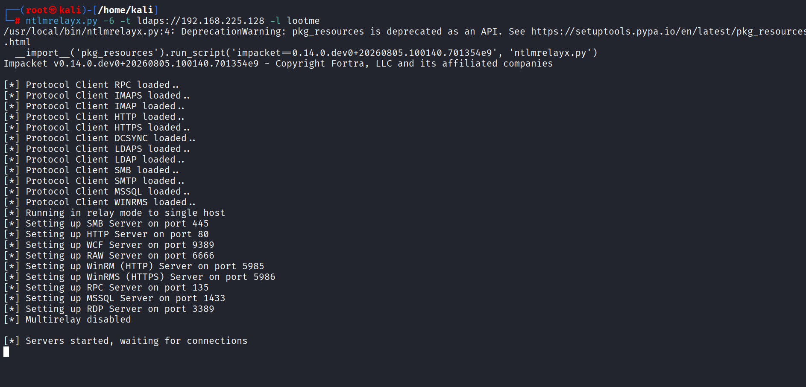
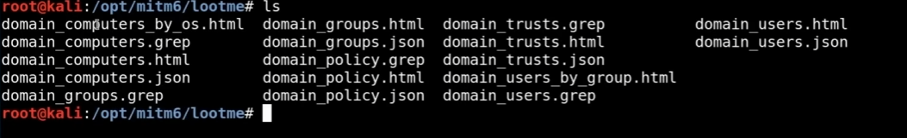
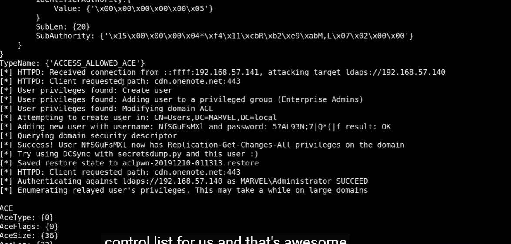
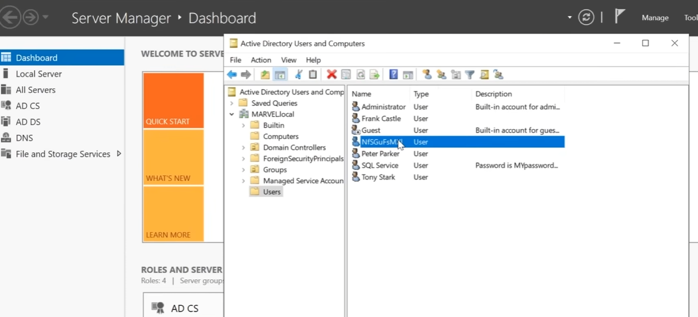

# IPv6  DNS Attacks

Attack Flow:

A Windows machine joins the network or performs normal network activity.
mitm6 influences IPv6/DNS configuration used by that machine.
The machine attempts to access a resource or resolve a name.
The machine connects to an attacker-controlled service.
Windows automatically performs NTLM authentication to that service.
ntlmrelayx receives the NTLM authentication.

ntlmrelayx relays the authentication to a target service such as:

LDAPS (Lightweight Directory Access Protocol over Secure Sockets Layer)
ldaps://192.168.225.128
If the target accepts the authentication, ntlmrelayx establishes a session using the privileges of the authenticated account.
ntlmrelayx can then perform whatever LDAP operations its modules support and whatever the authenticated account is authorized to do.
Results gathered from those operations can be written to the directory specified with:
-l lootme

The exact actions available after authentication depend on:

Which ntlmrelayx module is being used,
Which protocol is targeted (LDAP, LDAPS, SMB, etc.),
The privileges of the relayed account,
Security settings on the target system.

## mitm6

mitm6:

mitm6 is a tool that takes advantage of Windows IPv6 behavior. It advertises itself as a source of IPv6 network configuration and DNS information. As a result, Windows machines on the network may begin using DNS information influenced by the attacker.

When a Windows machine later tries to resolve certain names or access certain network resources, it may be directed to an attacker-controlled service. Some Windows services can automatically attempt NTLM authentication when connecting to a resource they believe is legitimate.

## NTLMRelayx

ntlmrelayx:

ntlmrelayx listens for incoming NTLM authentication attempts. When it receives an NTLM authentication, it does not crack the password. Instead, it forwards the authentication to another service, such as LDAP, LDAPS, or SMB.

If the target service accepts the relayed authentication, ntlmrelayx can establish a connection to that service using the permissions of the authenticated account.

LDAPS:

LDAPS (LDAP over TLS/SSL) is a protocol used to communicate securely with Active Directory.

Through LDAP/LDAPS, authorized users and systems can perform directory-related operations such as:

Querying users
Querying groups
Looking up computer accounts
Reading domain information
Reading certain policies and configuration data

The actions that are possible depend entirely on the permissions of the authenticated account.

After rebooting a Windows machine
The PC starts booting.
Windows initializes the network adapters.
Windows sends IPv6 network discovery messages to learn about available network services.
mitm6 responds to those IPv6 requests and advertises itself as a source of DNS/IPv6 configuration.
Windows accepts that information and begins using the DNS configuration influenced by mitm6.
During startup, Windows and various services perform normal network activity such as:
Name resolution
Network connectivity checks
Domain-related communication
Accessing configured resources
If one of those activities causes Windows to connect to an attacker-controlled service, Windows may automatically attempt NTLM authentication.
The NTLM authentication is received by ntlmrelayx.

ntlmrelayx forwards the authentication to the configured target, for example:

ldaps://192.168.225.128
The target service validates the authentication.
If authentication succeeds, ntlmrelayx establishes a session using the permissions of the authenticated account.
ntlmrelayx can then perform whatever actions its LDAP/LDAPS modules support and whatever the relayed account is authorized to do.
Information gathered from the target can be saved to the directory specified with:
-l lootme

After signing into Windows
The user enters their username and password.
Windows creates a user session and loads the user's profile.
Windows starts background services and applications associated with that user.
The computer may perform various network activities such as:
Checking network connectivity
Resolving DNS names
Accessing shared resources
Applying Group Policy
Contacting domain services
Accessing intranet or enterprise applications
If the machine is using IPv6/DNS information influenced by mitm6, some of those requests may be directed toward attacker-controlled services.
When Windows connects to what it believes is a legitimate network resource, it may automatically attempt NTLM authentication.
ntlmrelayx receives that NTLM authentication attempt.
ntlmrelayx relays the authentication to the configured target service (for example LDAPS).
If the target accepts the authentication, ntlmrelayx can interact with that service using the permissions of the authenticated account.
Any information gathered can be written to the output directory specified with:
-l lootme

here after logging as administrator.
the ntlmrelayx capture the administrator authentication challenge and succeeded to logging into domain controller . 

ntlmrelayx created a new domain account with a privileges.

## another attacks

https://dirkjanm.io/worst-of-both-worlds-ntlm-relaying-and-kerberos-delegation/

