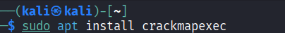
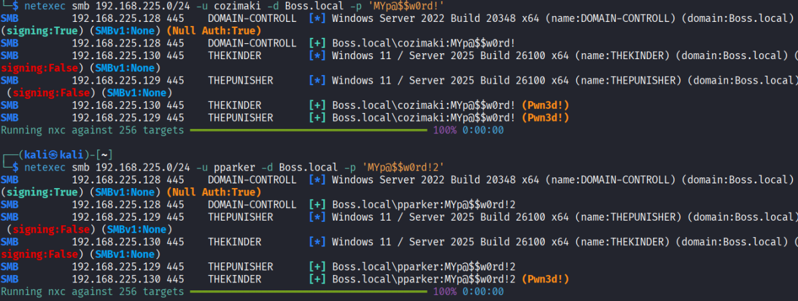
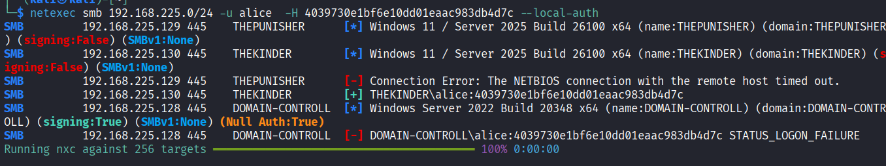
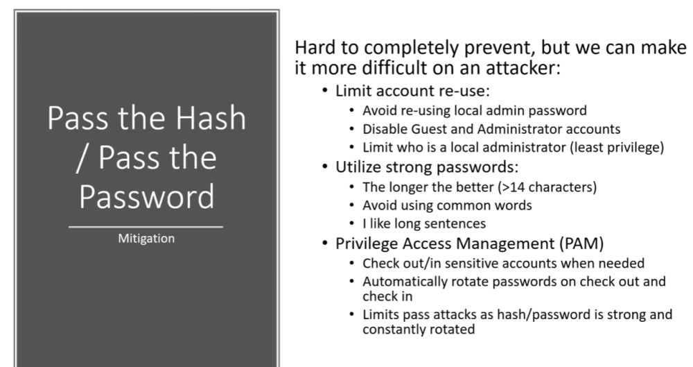

# Pass The Password /The Hash attack

Be careful when password spraying domain user accounts because account lockout policies can lock users out after several failed attempts. Local accounts may also have lockout policies, so you should verify the configuration before testing.

Using Crackmapexec (latest version : NetExec ) tool 

NetExec (nxc) is a powerfull tool used for Windows and Active Directory enumeration and authentication testing. It can discover hosts, identify OS/domain information, test credentials, enumerate SMB shares, users and groups, check logged-on users, inspect SMB security settings, and gather AD information.

check 

 nxc smb -h 

Sudo apt install netexec

## Pass the Password attack

notice that cozimaki is a local administrator on THEKINDER,THEPUNISHER machines 
but pparker is a local administrator only on THEKINDER machine

## pass the Hash attack

NOTICE : u can pass around ntlm hashes but u can't pass around ntlmv2 hashes

ntlm hashes are those stored on Sam 

[*] smb://BOSS/COZIMAKI@192.168.225.130 [1] -&gt; Dumping local SAM hashes (uid:rid:lmhash:nthash)
Administrator:500:aad3b435b51404eeaad3b435b51404ee:31d6cfe0d16ae931b73c59d7e0c089c0:::
Guest:501:aad3b435b51404eeaad3b435b51404ee:31d6cfe0d16ae931b73c59d7e0c089c0:::
DefaultAccount:503:aad3b435b51404eeaad3b435b51404ee:31d6cfe0d16ae931b73c59d7e0c089c0:::
WDAGUtilityAccount:504:aad3b435b51404eeaad3b435b51404ee:366b974b6c4d4da36ca6942671341d8e:::
defaultuser0:1000:aad3b435b51404eeaad3b435b51404ee:325e8cf4179f033927366439707b554e:::
Alice:1001:aad3b435b51404eeaad3b435b51404ee:4039730e1bf6e10dd01eaac983db4d7c:::

we're gonna take this :  4039730e1bf6e10dd01eaac983db4d7c

passing the sam hash can be usefull when we are logging as local administrator user  , becuase some companies use the same password for all local admins.

## Mitigation

