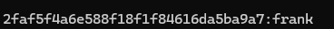

# cracking ntlm hashes using hashcat

<?xml version="1.0" encoding="UTF-8"?>
<node><rich_text>Administrator:500:aad3b435b51404eeaad3b435b51404ee:31d6cfe0d16ae931b73c59d7e0c089c0:::
Frank Castel:1001:aad3b435b51404eeaad3b435b51404ee:2faf5f4a6e588f18f1f84616da5ba9a7:::
Alice:1001:aad3b435b51404eeaad3b435b51404ee:4039730e1bf6e10dd01eaac983db4d7c:::

hashcat.exe -m 1000 &lt;targetFile&gt; &lt;passwordlist&gt; -O

</rich_text><rich_text justification="left"></rich_text><rich_text>

</rich_text><rich_text foreground="#33d17a">notice that administrator's password is blank means password for administrator disabled</rich_text><rich_text>
</rich_text></node>

